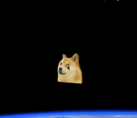

# Desktop Doge GPT – macOS desktop pet



A tiny Doge **desktop-pet** that lives on your Mac, chats with GPT-4o and
shows the live Dogecoin price.
Built entirely with **Cocoa / PyObjC** – no Tkinter required.

---
## Quick start (end-user)

1. Download the ready-made DMG → **[Doge GPT.dmg](https://downloadmacos.com/macshare.php?call=doge)**
2. Open it and drag **Doge GPT.app** into *Terminal*
3. Double-click the app; grant network permission on first run
4. Paste your OpenAI key when asked – done!

---
## Features

• Drag-and-drop border-less 128 × 128 Doge (left-click & drag)

• Double-click → ask Doge anything – runs an OpenAI chat request in a safe
  background thread and shows the reply in a speech bubble (≤ 25 words)

• GPT replies carry a mood tag (`<mood:HAPPY|LAUGH|WOW|SAD|THINK>`) and Doge's
  animation swaps automatically

• Right-click menu with *Exit*

• Single-tap → blue bubble with the current Dogecoin price

• Live web context: DuckDuckGo Instant-Answer snippet is passed to GPT; if the
  query is about price Doge quotes the live value fetched from CoinGecko

• Idle helper: every 10 min (configurable) Doge shows the price bubble while no
  chat is active; animations revert to the idle spinning-coin after 6 s

• First launch modal prompts for your OpenAI API key and stores it securely in
  `~/.openai_api_key` (0600) – no Terminal needed

---
## Build from source

```bash
# macOS 13 or newer
brew install python@3.12 pyenv        # or use the system Python 3.12
python3 -m venv .venv && source .venv/bin/activate
pip install -r requirements.txt       # PyObjC, openai, requests, py2app …

# clean build
rm -rf build dist
python setup.py py2app
open dist/Desktop\ Doge.app           # test run
```
---
## Customising Doge

Animations and prompts live in `assets/doge/`:

* `3d-doge-spins-like-coin-idle.gif` – idle loop (replace with any 128×128 GIF)
* other mood GIFs: same directory, file names configured in `cocoa_pet.py`
* `config.json` – personality prompt template (advanced)

---
## Requirements

* macOS 13 or later (Apple Silicon & Intel)
* Python 3.12 when building from source (the DMG is self-contained)
* OpenAI account with API key (first 5 USD free)

---
## Credits

Based on the open-source idea by [Shirros/desktop-pet](https://github.com/Shirros/desktop-pet).
Re-implemented in Cocoa & PyObjC by @yourname.

Dogecoin ❤ and Shiba Inu meme art belong to their respective creators.
